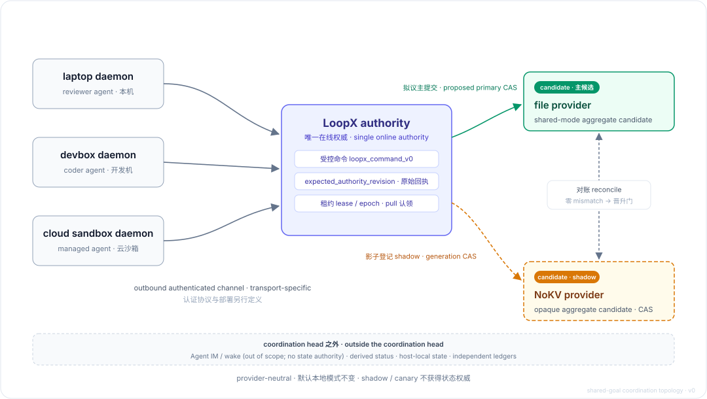

# RFC: Shared-Goal Online Authority and Pluggable State Provider (v0)

- Status: Draft, request for comments
- Proposed by: NoKV Lab, drafted in collaboration with the LoopX maintainer
- Date: 2026-08-05
- Scope: the LoopX control plane. Fills the "separate deployment contract"
  slot reserved by
  [`host-integration-surface-v0`](../../reference/protocols/host-integration-surface-v0.md)
- Evidence baseline: every performance number and behavioral claim in this
  proposal comes from real-environment measurement (see Appendix A and the
  [companion evidence document](./shared-goal-authority-state-provider-v0-evidence.zh-CN.md)),
  not design-time estimation
- Language note: the [Chinese version](./shared-goal-authority-state-provider-v0.zh-CN.md)
  is the authoritative text; this is a faithful translation

---

## 0. TL;DR

The reason LoopX brings in NoKV is this need: let agents spread across
multiple machines collaborate around one shared goal, without depending on
a human to relay instructions, thereby eliminating the waiting inside every
handoff and maximizing the throughput of an AI workforce (see Example 1).

The most elegant part of the LoopX author's design: machines are abstracted
into departments. To raise efficiency, the departments are automated and
chained into a pipeline, and each department only needs to care about two
things: what is being handed over, and whether the handover succeeded. NoKV
maintains all the state in the cloud, like a central document that every
department (machine) can consult at any time, with correctness guaranteed.

To satisfy this need, this RFC defines three things:

1. **One online authority**: cloud-side storage that maintains the truth of
   state; all coordination state defers to it;
2. **One set of controlled commands**: the single entry point for all
   cross-device writes, surfacing concurrency conflicts explicitly instead of
   silently letting a later write clobber an earlier one;
3. **One pluggable state provider**: the storage layer behind the authority.
   Local files go first; NoKV enters as the first database backend in a
   shadow (companion) role: every entry gets a second copy written alongside,
   without ever touching the main path. NoKV plays the role of a cloud
   filesystem here.

## 1. Example 1: a real machine -> human -> machine handoff, and why it is slow

For instance: my agent on the devbox finished two PRs, and the agent on my
laptop is responsible for review. The handoff, in chronological order:

- **T0** (01:01 pm): my devbox agent finishes its work; two PRs are created.
- **T1** (01:01 pm): the code is delivered through the PRs' pinned head SHAs.
  Git does this step, so delivering the code itself was never the problem.
- **T2** (01:28 pm): I manually send the two PR links, the source task ID,
  and the instruction "explain the reasoning and review" to the review task
  on my laptop.
- **T3**: no structured acknowledgment. I can only infer that the reviewer
  took the job from its later behavior (it read the PRs, raised a blocker,
  pushed a fix commit).

⚠️ Between T0 and T2 sit 27 minutes. For those 27 minutes the agents were
not working; they were all waiting for me (and you!). The only reason work
resumed at 01:28 is that I happened to be in front of the laptop, saw the
PRs were up, and typed out the forwarding message by hand.

**No matter how efficient the harness is or how fast the model reasons, it
cannot offset the AI-throughput loss of a night's sleep.** The longer the
goal and the more handoffs it has, the larger the share of total time this
waiting eats. It is the number-one killer of AI workforce throughput.

So what is today's LoopX missing? Git and PR messages carry no coordination
information between components/servers: why the review is needed (goal
lineage), who should do it (the executor), against which version, what
counts as done (acceptance criteria), who claimed it (the record), whether
it was picked up (the receipt), and what happens if nobody picks it up
(timeout and re-dispatch). None of that exists today, and Git cannot
provide it.

What this RFC converges on is exactly T2 and T3: the moment an agent
finishes, the successor task is created automatically; the right endpoint
discovers and claims it automatically; a successful claim produces a
verifiable receipt. The human stays purely in the decision-maker role,
never ferrying information between two endpoint agents. (You know the
feeling.)

## 2. What we will do, and what we will not

**What we will do**

1. Share one goal's coordination state across endpoints: todos, claims,
   leases, receipts, quota.
2. Route every cross-device write through controlled commands: concurrency
   conflicts are surfaced explicitly, and a crash-retry never produces a
   duplicate effect.
3. Make the storage backend pluggable: local files first, then database
   backends such as NoKV slide in, with zero change to any upper-layer
   semantics.

**What we explicitly will not do** (keep the scope narrow and fit)

- No multi-tenant public service: P0 (the first delivery phase, hereafter)
  serves only one user's trusted devices.
- No offline multi-writer merging: an offline endpoint cannot produce
  controlled writes.
- No sharing of raw evidence, credentials, absolute paths, or transcripts.
- No event bus or message queue: P0 has one user and a handful of devices;
  one authority plus periodic pulls from each endpoint covers every
  scenario, and one more middleware is just one more failure point.
- The provider takes no part in scheduling decisions: it is the storage,
  not the bookkeeper.

## 3. Design draft



Example 2: **the authority is the only bookkeeper.** The endpoints (devbox,
laptop, phone, and so on) never write the ledger directly; they only submit
"bookkeeping requests" (controlled commands). The bookkeeper audits each
one: is the ledger version right, is this actor qualified, has this entry
been recorded before. If the audit passes, the entry lands and a receipt is
issued; if not, the request is rejected explicitly with the reason.

Where the records live (files, NoKV, some other db) is something the
requesters (the endpoints) neither need to know nor can perceive.

Four decisions, each answering one "why":

1. **Why one shared goal, instead of each endpoint writing its own copy and
   merging later?** Because merging two diverged copies of coordination
   state means solving three hard problems at once: claim conflicts,
   completion-state rollback, and clock skew. Getting any one of them wrong
   loses work or does work twice. A single authority removes these problems
   at the source, and the only price is "writes must be online" (for what
   happens offline, see Section 8).

2. **Why pull-based claiming?** The authority only publishes "runnable
   work" (already past three checks: gate clearance, dependencies,
   capability match). Endpoint daemons come with their identity and claim
   atomically; only one can win. This way the authority never has to
   maintain an idleness profile of every machine, and endpoints can join or
   leave without a registration ceremony. Central assignment is deferred to
   the mid-term, and only in a restricted form (see Section 11).

3. **Why must writes carry a version number?** Every controlled command
   carries the ledger version its requester saw (`expected_revision`); a
   stale version is rejected. This is optimistic concurrency control. As an
   example: "this decision of mine is based on the previous page; if the
   ledger has already turned the page, reject this command (the command
   itself is the judge), and I will look at the newest page and decide
   again." This is where "conflicts surfaced explicitly" lands: when two
   endpoints race for one task, the loser gets an unambiguous
   "version stale" instead of being silently overwritten.

4. **Why does NoKV start as a shadow?** A new backend follows the books
   before it keeps the books. Every entry is registered as a shadow copy at
   the moment the primary ledger (local files) commits, with periodic
   reconciliation; only after the shadow shows sustained zero-mismatch and
   passes fault-injection acceptance do we discuss promotion (see
   Section 6). Coordination state is a ledger that must not be wrong, so
   this ordering makes introducing a new backend zero-risk to the main path.

## 3.1 Why version numbers (the optimistic-locking rationale)

The traditional approach is pessimistic locking: take a lock before
changing anything, and everyone else queues. Problem: if the lock holder
dies, who returns the lock? And most of the time nobody is competing with
you anyway, so the cost of locking is paid for nothing.

Optimistic concurrency bets the other way: conflicts are the minority.
Everyone reads and submits freely at zero locking cost; only when a
collision actually happens does the version comparison stop the loser. Win
the bet (the vast majority of the time) and the overhead is zero; lose it
and the price is merely "re-read once and decide again."

The brilliance is the engineering economics: the whole mechanism needs one
integer and one comparison. No locks, no queues, no clock synchronization
across endpoints, and yet it solves the hardest problem in distributed
coordination: who came first. It also fits the agent scenario unusually
well: an agent's working loop is already "read state → decide → act", and
`expected_revision` is essentially a timestamp stamped onto the decision,
recording "the world as I saw it", so the bookkeeper can judge whether that
decision still holds at the instant it lands in the ledger.

## 3.2 Example 3: A cannot carry on, and the task changes hands

Say you have three machines A, B, and C, all running LoopX. The agent on A
is in the middle of a task, but A is running out of resources (disk nearly
full / compute starved) and cannot continue on its own. Here is what
happens:

1. A does not "shove" the task at B or C. A submits one controlled command
   to the authority: surrender the lease and return the task to the
   claimable pool, carrying the ledger version A saw, v999.
2. The authority audits and lands the entry: the ledger turns to v1000, and
   the task reappears in the "runnable work" list. The same entry is
   simultaneously registered into the NoKV shadow ledger.
3. B's and C's daemons pick up "work available to claim" on their own
   heartbeats and submit claim_work at the same time, both carrying
   expected_revision=1000. No locks; nobody waits for anybody.
4. The authority processes entries one by one: B, arriving first, succeeds;
   the ledger turns to v1001 and B receives the receipt (applied + a new
   lease with lease_id/epoch). C, arriving later, gets an explicit conflict
   (the current version is already v1001). C re-loads, sees the task now
   belongs to B, and turns to other work. A's old lease has already been
   surrendered, so even if A comes back to life it can no longer write into
   this task (the epoch has moved to a new generation).
5. The NoKV shadow ledger records every one of these entries, and the
   reconciliation loop later verifies the primary and shadow books entry by
   entry.

If NoKV is later promoted to primary (the authoritative truth), not one
word of this flow changes; the only difference is that the version
comparison in step 4 moves from the file ledger into NoKV's generation CAS
(adjudicated inside the server's serialized commit).

## 4. Every cross-device write takes one wrapped command: `loopx_command_v0`

All cross-device writes use one uniform envelope. Take "claim the review
task" from Example 1:

```json
{
  "schema_version": "loopx_command_v0",
  "command_id": "cmd_claim_review_704_705",
  "idempotency_key": "goal:review-704-705:laptop:v1",
  "actor": {"agent_id": "laptop-review", "device_id": "laptop"},
  "goal_id": "ark-agent-loop-shared",
  "expected_revision": 1842,
  "command": {
    "type": "claim_work",
    "todo_id": "todo_review_704_705",
    "expected_todo_revision": 7,
    "lease_ttl_seconds": 600
  }
}
```

Field by field:

- `command_id`: the unique identity of this one request. Retry after a
  crash with the same id, and the authority guarantees the entry is not
  recorded twice.
- `idempotency_key`: the business-level dedup key, expressing "this thing
  happens once" across requests.
- `expected_revision`: the goal-ledger version the requester saw (see
  Section 3, decision 3).
- `expected_todo_revision`: the target todo's own version, preventing you
  from claiming a task whose content has already changed.
- `lease_ttl_seconds`: the lease duration. Why leases exist: the claimant
  may die mid-way; when the lease expires without renewal, the work
  automatically returns to the claimable pool instead of being stuck
  forever with a dead endpoint.

**The receipt is the only proof of success.** A successful response must
contain `result=applied`, the new `authority_revision`, and
`lease_id / epoch / expires_at`. Here epoch is the lease's generation
number: every time the work changes holder, the generation increments, and
a former holder submitting with an old generation is recognized and
rejected. The T3 ACK that was missing in Example 1 is, in this design,
exactly this receipt.

The receipt has five states:

| result | Meaning | The requester's correct reaction |
|---|---|---|
| `applied` | Entry landed | Start working; renew the lease on cadence |
| `already_applied` | This entry was already recorded (idempotent replay) | Treat as success; retrieve the original receipt |
| `conflict` | Version stale, or already claimed by someone else | Re-`load`, decide against the new version |
| `rejected` | Permission, gate, or validation failure | Do not retry; human intervention |
| `failed` | Transient infrastructure fault | Bounded backoff and retry |

The first command set (bound to existing LoopX primitives, see Section 11):

- `claim_work`: atomic claim + lease acquisition.
- `complete_todo_with_successor`: atomically complete the current todo and
  create the successor todo (for example, the same instant "implementation
  done" lands, "awaiting review" comes into existence, bound to the exact
  head SHA). This is precisely the mechanism that eliminates T2: the
  successor task exists at the moment of completion, no human relay needed.
- `assign_work` (mid-term): restricted delegated assignment, see Section 11.

## 5. The state-provider contract that makes "pluggable" real

The provider is the storage layer behind the authority, so the contract is
deliberately minimal:

```
load() -> (envelope_bytes, revision)
compare_and_put(expected_revision, command_id, envelope_bytes)
    -> applied(new_revision) | conflict(current_revision) | already_applied
```

Why only two verbs: the fewer the verbs, the easier the backend swap, and
only then is "pluggable" true. Local files, NoKV, or any other database can
implement this contract in one or two hundred lines, while the authority's
entire concurrency semantics rest on just four properties of these two
verbs (this part is key):

1. **CAS atomicity** (Compare-And-Set: compare first, then write): the
   version comparison and the write are one indivisible action, guaranteed
   by the storage layer's single-writer serialization.
2. **Exactly one**: among concurrent requests carrying the same
   `expected_revision`, at most one succeeds; the rest get an explicit
   conflict carrying the current version for retry.
3. **Idempotent retry**: replaying the same `command_id` returns the
   original result and produces no second effect.
4. **Receipt means durable**: once applied is returned, the entry must
   survive even if the process is kill -9'ed the next instant.

**The NoKV provider mapping** (measured; see Appendix A). NoKV plays the
role of a cloud filesystem here: the shadow copy of a goal's ledger is one
file (the head document), and every file carries a server-maintained
version number (generation). `revision` maps directly onto generation
(validated and incremented inside the server's serialized commit); all of a
goal's commands go through the same head-document path, landing on the same
NoKV write partition (root/shard), where a single writer processes entries
one by one at any moment, which naturally satisfies single-writer
serialization.

Four adapter disciplines are written into the contract. Missing any one of
them, the typed-conflict semantics distort or double-writes appear; the
"zero anomalies" in Appendix A is exactly what an implementation carrying
all four produced:

1. **Never delete the head document**: delete-and-recreate resets the
   version to 1, which is winding the ledger's page number backwards.
2. **The envelope must be byte-deterministic** (no wall-clock fields minted
   at generation time): idempotent replay identifies "this is the same
   entry" by byte-for-byte comparison.
3. **The operation id is derived from `command_id` by a fixed rule** (the
   same command always yields the same id): on a crash-retry the server
   recognizes at a glance that "this entry is already recorded" and returns
   the original result. If an id gets burned by a failed attempt, rotate to
   the next by a fixed rule, but the first rule-derived value must stay
   reserved for crash-replay recognition.
4. **Conflicts must be classified, never blanket-retried**: when the
   storage layer reports "the same operation id was reused with different
   contents", that error is itself proof the original command already
   landed; it must be converted to already_applied and the original result
   retrieved, and you must never resend under a new id (that double-writes).
   Transient contention errors get bounded retries; when retries are
   exhausted and the ledger version has not advanced, report `failed`
   (infrastructure fault), not `conflict`.

## 6. Dual-write and reconciliation: the shadow lane is waved through

In P0 the file provider is primary and NoKV is the shadow:

1. **Registration**: at the moment the primary commit lands, the same
   envelope is registered as a shadow write. Registration goes through a
   local outbox (written to a local staging queue first, auto-redelivered
   when the network recovers, cleared only after delivery succeeds), so a
   brief shadow outage only builds backlog and never blocks the main path.
2. **Reconciliation**: against the canonical projection (the normative view
   derived from the primary ledger), periodically compare the primary and
   shadow books; every mismatch is recorded and alarmed.
3. **Promotion review**: only after sustained zero-mismatch, plus a real
   handoff completed end to end, plus fault injection passed (process kill,
   disk full, network jitter) do we discuss NoKV taking on more duties.
   Promotion is an explicit decision, never automatic.

Why this ordering: **coordination state is a ledger that must not be
wrong.** Let the new backend accumulate evidence in a "follow the books,
never keep the books" role; the cost is one shadow write per command
(measured median 86ms, see Appendix A), and what it buys is zero risk to
the main path.

## 7. P0 deployment shape

- **Topology**: the LoopX authority (merged with the access relay; the
  relay is simply the door the endpoints connect to, and merged they are
  one process) is deployed on one public-cloud server (ECS); laptop /
  devbox / private cloud sandbox all **connect outbound** to the authority
  (TLS + device token, or mTLS mutual-certificate authentication).
  Endpoints open no inbound ports, so no public IPs, no NAT traversal, no
  firewall configuration.
- **Tenancy**: a single trusted user. No multi-tenancy, no K8s, no HA, no
  standalone message bus.
- **The NoKV stack**: co-located with the authority, bound to 127.0.0.1
  only. Transport security toward the outside is carried entirely by the
  authority; the storage layer is never exposed on the network.
- **Credentials**: private Git credentials stay in each endpoint's local
  secret store and never enter the authority.

## 8. Availability budget and degradation rules

Service-level budget (used for P0 acceptance; "P95 ≤ 10 s" means 95% of
cases are no slower than 10 seconds):

| Item | Budget |
|---|---|
| daemon heartbeat | one beat / 15 s; unseen for 45 s marks suspect; 90 s judges offline |
| online wake (delay from new work appearing to the target endpoint discovering it) | P95 ≤ 10 s, hard cap 30 s |
| read-only projection | P95 ≤ 5 s; beyond 30 s must be explicitly labeled stale |
| lease | default TTL 10 minutes, renewed every 60 s |

The degradation rule in one sentence: **offline you may keep working, but
you may not touch the books.**

- When the authority is unreachable, local editing, compiling, and testing
  of already-claimed work continue as normal, and results may be written to
  the local outbox.
- But not allowed: new claims, lease renewal, completion, reassignment,
  gate/quota changes, or publishing any external side effect.
- On reconnection, submit `lease_id + epoch + base revision + artifact
  digest` (a digest is a content fingerprint: a short string that uniquely
  identifies this artifact). If the lease is still valid, completion is
  allowed; if it has expired or been reassigned, the result is downgraded
  to a stale candidate: the system keeps it for human review but never
  writes it into the ledger automatically, because it was produced under an
  authorization that no longer holds.

This rule is the most important trade-off in the whole design: give up the
convenience of "claiming while offline", and gain the certainty that "at no
moment can two endpoints own the same piece of work."

## 9. Privacy

**Shared across endpoints** (all of it compact coordination facts):
goal / todo / agent / device identifiers, version numbers, task class,
dependencies and gates, claims and leases, repo plus exact revision
pointers, commands and idempotency receipts, quota and scheduler state,
liveness signals, and **evidence pointers** carrying a digest and a privacy
class.

**Never shared**: raw evidence bodies, credentials, local absolute paths,
conversations and run records (transcripts). When evidence must be
referenced, share the pointer and the summary; the body stays on the
machine that produced it.

## 10. Acceptance

The P0 acceptance list (every item machine-checkable):

1. The real scenario of Example 1 runs end to end with zero human
   forwarding.
2. Two endpoints claim the same todo concurrently: exactly one `applied`,
   the other an explicit `conflict`.
3. After a crash at any step, retrying with the original `command_id`
   leaves no duplicate effect in the ledger.
4. While the authority is down, each endpoint degrades exactly as Section 8
   describes; after recovery, no dirty writes.
5. Every receipt and projection passes the privacy-boundary scan (zero
   leakage of Section 9's "never shared" items).
6. Shadow reconciliation runs continuously with zero mismatch (the
   prerequisite evidence for NoKV's promotion gate).

## 11. Schedule

**P0 (the scope of this RFC)**

LoopX side (mostly new; parentheses name the existing primitives to bind):

- the `loopx_command_v0` envelope and five-state receipts (semantics follow
  the existing controlled-command RFC)
- `claim_work` (bind todo claiming + the `task_lease_v0` lease: its
  idempotent acquire and version CAS are directly reusable; add the minting
  rules for lease_id / epoch, and parameterize TTL down to the 10-minute
  tier)
- `complete_todo_with_successor` (bind the existing single-lock atomic
  complete + successor primitive, adding the version check and the receipt)
- the provider seam (`load` / `compare_and_put`) and the file provider
- shadow registration and the reconciliation loop
- device identity and outbound transport (device token / mTLS)
- the per-goal `authority_revision` counter (new; mind the naming clash
  with the existing `command_id` and the lease's `version` field)

NoKV side:

- the shadow-provider implementation (reference implementation, ~200 lines,
  attached to this RFC)
- typed conflict exceptions in the SDK (carrying the current version,
  replacing string parsing)
- fixes for the known transients (retry on the publish-finalization path;
  auto-retry on the read path at the instant a document is concurrently
  replaced)

**Mid-term (not a P0 commitment)**

- `assign_work` delegated assignment, with five preconditions of which none
  may be missing: the target endpoint is recently online and
  capability-matched; the target explicitly allows delegated assignment;
  the coordinator holds a goal-scoped, action-scoped grant; the assignment
  carries a short TTL and an ACK deadline; on missed ACK it is
  automatically revoked and republished.
- NoKV promotion review: prerequisites are the full promotion gate of
  Section 6, plus NoKV-side service recovery (successor takeover after a
  process crash) landing.

## 12. Open questions (community input welcome)

1. If NoKV misbehaves while live and an end-to-end handoff fails, what is
   the fallback strategy, and where is the boundary of acceptable
   situations?
2. Anchoring of `authority_revision`: per-goal independent counters (this
   proposal's preference), or a global counter? Which canonical projection
   is the reconciliation baseline?
3. Minting and increment rules for the lease `epoch` (how to prevent
   rollback when a lease record is recreated).
4. Wake transport details: does the authority push over each endpoint's
   long-lived connection, or do endpoints pull on their heartbeat cadence?
   (The budget allows both; implementation complexity differs.)
5. Receipt retention window: for how long after the fact can an
   `already_applied` replay still retrieve the original receipt?
6. Naming: `command_id` collides with an existing CLI classification field;
   rename to avoid confusion?

---

## Appendix A: measured evidence (NoKV shadow provider)

The numbers below come from an end-to-end run on a real stack (etcd +
S3-compatible store + nokv serve + Python SDK, zero source changes). The
full probes and the reference implementation live in
[`examples/nokv-shadow-provider/`](../../../examples/nokv-shadow-provider/);
measurement details are in the
[companion evidence document](./shared-goal-authority-state-provider-v0-evidence.zh-CN.md):

| Probe | Result |
|---|---|
| Concurrent claim (8 endpoints, same version × 20 rounds) | Exactly one applied: 20/20, zero anomalies |
| Idempotent replay (same command_id) | Original result returned, ledger unchanged, lease_id stable |
| kill -9 durability | Data intact: WAL (write-ahead log: land on disk first, then receipt) written synchronously, metadata directory complete; end-to-end re-verification by restart was not possible due to the service-recovery limit below |
| Multiple goals in one root | Each goal's version evolves independently, no interference |
| Latency | Conditional write median (p50) 86ms / p95 114ms; read median 25ms / p95 32ms |

Against the Section 8 budget: the storage layer consumes under 3% of it.
One known transient (a roughly 2%-probability, seconds-to-self-heal stall
on the publish-finalization path; the fix is on NoKV's work list).

NoKV's service recovery after a process crash is currently fail-closed
(meaning: it would rather refuse to restart and take over than keep serving
on unverified state), which is why it enters P0 only in the shadow role;
before promotion this capability must land and pass fault-injection
acceptance.
