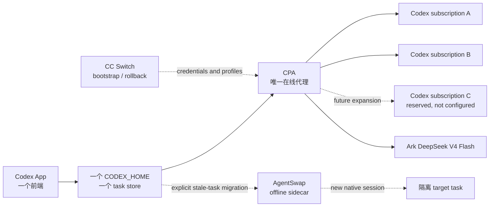

# Codex App 多订阅与多 Provider 切换 Runbook

> 配套文档：需要长期保留两个独立 App / `CODEX_HOME` 时，参见
> [Codex 多 App 隔离与运维最佳实践（中文）](codex-multi-app-best-practices.zh-CN.md)。

## 定位

这是一份面向操作者的 qualification runbook，不是 LoopX capability。它描述如何在
同一个 Codex App 中暴露多个 Codex 订阅与第三方 Responses provider，并把手动模型
选择、额度耗尽后的自动切换、轨迹兼容和离线迁移放在清晰的责任边界内。

LoopX 只记录目标、门禁、证据和回滚状态。它不保存 OAuth token，不成为模型请求代理，
也不接管 Codex 的 session store。

## 结论先行

采用 **CPA + AgentSwap**，但不要把两者串成双层代理：

| 组件 | 唯一职责 | 不负责 |
| --- | --- | --- |
| [CLIProxyAPI（CPA）](https://github.com/router-for-me/CLIProxyAPI) | 唯一在线 data plane：多账号选择、请求路由、同一任务的 provider-specific 轨迹投影、首字节前 failover、Responses/SSE 兼容 | 写 Codex 本地 rollout、跨 harness 搬运 session |
| [AgentSwap](https://github.com/bojieli/agentswap) | 离线 sidecar：显式 `teleport` / `handoff`、超长轨迹机械压缩、隔离迁移与灾难恢复 | 每次请求的热切换、第二层 retry / health / sticky routing |
| [CC Switch](https://github.com/farion1231/cc-switch) | 登录引导、凭据/profile 导入、升级前快照和回滚入口 | 每 turn 替换 `config.toml`、重启 App、在线路由 |

如果只能保留一个核心组件，保留 CPA。没有 AgentSwap，日常在线切换仍可运行；没有 CPA，
同一 App 内的多订阅选择和透明额度 failover 无法成立。

## 锁定的 qualification baseline

在升级前锁定 commit，不直接跟随上游 `main`：

| 项目 | 锁定版本 | 本 runbook 使用的边界 |
| --- | --- | --- |
| CPA | [`a7e3596b7e351d800e58ed29529fbca3d1c18737`](https://github.com/router-for-me/CLIProxyAPI/commit/a7e3596b7e351d800e58ed29529fbca3d1c18737) | 多 Codex OAuth、`fill-first`、priority、prefix、session affinity、stream bootstrap buffering、OpenAI-compatible provider |
| AgentSwap | [`c9b76f4a4adae81274eb8f52d428bba925a1a7ef`](https://github.com/bojieli/agentswap/commit/c9b76f4a4adae81274eb8f52d428bba925a1a7ef) | `teleport` / `handoff`、`--dry-run`、`--compact`、`--budget` |
| Codex protocol reference | [`40b7560169c7274147a47f9b0c75db89fe016d34`](https://github.com/openai/codex/commit/40b7560169c7274147a47f9b0c75db89fe016d34) | `ResponseItem::Reasoning`、history normalization 和 remote compaction 行为的源码参照 |
| CC Switch | [`43eaf07355af145aebfee301801779e824d4c221`](https://github.com/farion1231/cc-switch/commit/43eaf07355af145aebfee301801779e824d4c221)（v3.19.2） | 只作为 bootstrap / rollback 基线，不进入请求链路 |

锁定 commit 只是可复现实验起点，不等于四个项目已经共同承诺兼容。每次升级都重新运行
本文的 compatibility matrix；通过后再修改 pin。

## 当前 qualification snapshot

当前参考部署只有两个有效 Codex 订阅，记为 A、B；C 是未来扩容保留位，不应出现在
当前生产 selector 或 failover 队列中。目标态仍允许增加 C，但配置和验收必须以“实际
存在的 credential”为准，不能用空 profile 假装第三个可用账号。

锁定 CPA baseline 上已经形成一个尚未发布的 review candidate。它不是新的安装 pin，
也不能替代 upstream PR；当前证据边界如下：

| Surface | 当前进展 | 证据边界 |
| --- | --- | --- |
| A → B credential failover | 已通过 | `fill-first`、priority、session affinity 与首个可见事件前的 stream failover 已在源码构建的 loopback 场景验证 |
| Provider-bound history normalization | 已实现候选补丁 | 同 provider 的 A → B 也视为 scope 变化；跨 scope 时移除异源 identity / opaque state，保留可移植 summary，并校验 tool call/result 因果链 |
| Ark Responses SSE lifecycle normalizer | 已实现候选补丁 | 只对显式 `is-compat: true` 的模型启用；原生 Codex stream 保持原字节路径 |
| A → B → Ark 组合路径 | loopback 已通过 | 两个订阅依次返回 quota error，Ark 返回故意缺少 item lifecycle 的 SSE；下游只收到一条被规范化的 stream |
| 上游回归 | 已通过候选分支 | 全量 Go test、server build、history/SSE focused test 与相关 race test 通过 |
| 真实 Ark endpoint qualification | 仍是上线门禁 | loopback 证明 adapter 与状态机，不证明真实模型端点、限流语义、长上下文或 tool use 行为 |
| 当前 Codex App | 未改动 | 尚未合并双 App、迁移登录态或开启生产 heterogeneous auto route |

这张表刻意区分“adapter 证据”和“provider 证据”。只有真实 Ark 调用产生的有界、脱敏
readback 才能把最后一项从门禁改成已通过。

## 总体架构



硬规则：

1. Codex App 只连接一个本地 CPA endpoint。
2. CPA 不再转发到 AgentSwap proxy；AgentSwap 也不反向代理 CPA。
3. 在线切换优先保持同一个逻辑 task；无法无损投影时才 fork，不覆盖源 task。
4. 不在两个生产 `CODEX_HOME` 之间复制 rollout 文件或 SQLite 行。
5. 凭据只进入本机 secret store 或权限受限的 auth 文件，不进入仓库、日志和轨迹。

## 用户看到的模型

建议在 Codex App 模型下拉框中暴露稳定的虚拟模型 ID：

| 模型 ID | 行为 |
| --- | --- |
| `auto/gpt-5.6-sol` | 目标态：Codex A → B → 可选 C；所有已配置订阅都不可用且尚未提交输出时，转 Ark |
| `codex-a/gpt-5.6-sol` | 手动固定到订阅 A |
| `codex-b/gpt-5.6-sol` | 手动固定到订阅 B |
| `codex-c/gpt-5.6-sol` | 预留；只有第三个订阅真实接入并通过矩阵后才暴露 |
| `ark/deepseek-v4-flash` | 手动固定到 Ark DeepSeek V4 Flash |

模型 ID 是路由契约，不是上游真实 model slug。显示名可本地化，但 ID 一经上线应保持稳定，
否则已有 task 的 model metadata 会产生第二种方言。

当前 CPA pin 已能完成同 provider 的多账号选择和 prefix 固定路由。Codex OAuth 与 Ark
之间的 heterogeneous alias failover 仍须通过后文门禁；在通过前，`auto/...` 只自动轮转
Codex 订阅，Ark 保持手动可选。不要用第二层 AgentSwap proxy 假装补齐这个缺口。

这里的“开启自动切换开关”不是修改 CPA 的一个全局布尔值，而是让 App selector 暴露并
允许选择 `auto/...` 虚拟模型。关闭时只暴露显式 `codex-a`、`codex-b` 和 `ark`；打开后
CPA 才按已验收的 provider pool 执行自动路由。

## CPA：唯一在线 data plane

### 从锁定 commit 构建

```sh
git clone https://github.com/router-for-me/CLIProxyAPI.git
cd CLIProxyAPI
git checkout --detach a7e3596b7e351d800e58ed29529fbca3d1c18737
go build -o ./bin/cliproxyapi ./cmd/server
```

把二进制 checksum、commit 和本机安装时间写入私有运维记录。升级使用新的隔离目录构建，
验证通过后原子切换 symlink；不要覆盖唯一可回滚的旧二进制。

### 基础配置

以下是公开安全的配置形状，尖括号内容必须由本地 secret/bootstrap 流程注入：

```yaml
host: "127.0.0.1"
port: <CPA_PORT>
auth-dir: "<CPA_AUTH_DIR>"

api-keys:
  - "<LOCAL_CODEX_TO_CPA_TOKEN>"

remote-management:
  allow-remote: false
  secret-key: ""

force-model-prefix: false
request-retry: 0
max-retry-credentials: 0
max-retry-interval: 0

routing:
  strategy: "fill-first"
  session-affinity: true
  session-affinity-ttl: "1h"

codex:
  stream-bootstrap-buffering: true
  optimize-multi-agent-v2: false
```

`fill-first` 与 auth 记录中的 `priority` 决定冷启动顺序。已建立的 session binding
优先于恢复后的高优先级账号，避免同一 task 在每个 turn 抖动；当前账号不可用时才重绑。

首轮 qualification 使用 `request-retry / max-retry-credentials / max-retry-interval =
0 / 0 / 0`。这不等于“完全不 failover”：round 0 仍会把每个 eligible credential 最多
尝试一次；它只禁止 A → B → Ark 之后再开启额外 retry round，也不等待 cooldown。这样
可以先证明一条有限、可解释的路由链，避免同一 credential 被重复尝试。需要额外 round
时必须单独增加参数并重跑提交边界测试。

`stream-bootstrap-buffering` 只允许在首个生成事件提交前吸收 in-band overload / rate-limit
错误。`multi_agent_v2` 不是这里的默认依赖；只有 compatibility matrix 覆盖 spawn、wait、
tool result 和 provider 切换后才单独开启。

### Codex 账号记录

每个 Codex OAuth auth 文件使用唯一 prefix 和递减 priority。示意形状如下，不要复制
token、email 或真实文件名到公共配置：

```json
{
  "type": "codex",
  "prefix": "codex-a",
  "priority": 300
}
```

当前第二个账号使用 `codex-b / 200`。`codex-c / 100` 只是未来约定；没有第三个有效
credential 时不要创建空 auth 记录。无 prefix 的自动模型路由与手动 prefix 路由必须
分别测试；不要依赖文件名字典序表达账号优先级。

### Ark provider

```yaml
openai-compatibility:
  - name: "ark-deepseek"
    prefix: "ark"
    base-url: "<ARK_RESPONSES_BASE_URL>"
    request-retry: 0
    api-key-entries:
      - api-key: "<ARK_API_KEY>"
    models:
      - name: "<ARK_DEEPSEEK_V4_FLASH_ENDPOINT_ID>"
        alias: "deepseek-v4-flash"
        display-name: "Ark DeepSeek V4 Flash"
        is-compat: true
        input-modalities: [text, image]
        output-modalities: [text]
        thinking:
          levels: ["low", "medium", "high"]
```

`is-compat: true` 是模型级兼容声明，不是“宽松解析所有错误”的开关。它让 handler 对该
次实际选中的 attempt 启用 Ark lifecycle normalizer；retry 选中另一个模型时必须用新的
attempt metadata 重置 validator，不能把 Ark 兼容状态泄漏给原生 Codex。

Ark qualification 还要覆盖两类 Responses 方言差异：

- 请求侧移除上游不接受的 `reasoning.summary` 字段；
- SSE 创建事件补齐 Codex 所需的空数组：reasoning item 的 `summary`、message item 的
  `content`、output-text part 的 `annotations` 与 `logprobs`。

候选 normalizer 还处理缺失的 lifecycle envelope：为孤立 reasoning / output-text delta
补出配对的 `response.output_item.added` / `done`，在 reasoning → message 转换时关闭前一
item，并抑制迟到的重复 added/done。遇到同时存在两个 active item、closed item 又收到
delta、缺少 terminal，或需要凭空完成 tool/function item 时必须 fail closed，不能猜测
tool 因果链。

修复只能补 schema 默认值，不能改写 item ID、文本、tool call ID 或事件顺序。若锁定的
CPA commit 尚未包含这些修复，就使用带可审计补丁的构建并保持 Ark 自动 fallback 关闭，
直到补丁进入可锁定的 upstream commit。

### Codex App 只指向 CPA

```toml
model_provider = "local-cpa"
model = "gpt-5.6-sol"

[model_providers.local-cpa]
name = "Local CPA"
base_url = "http://127.0.0.1:<CPA_PORT>/v1"
wire_api = "responses"
experimental_bearer_token = "<LOCAL_CODEX_TO_CPA_TOKEN>"
supports_websockets = false
```

上面的无 prefix 模型先用于 Codex A → B → C 自动轮转。让 CPA `/v1/models` 或受控的
model catalog 暴露手动虚拟模型 ID，App 的原生模型下拉框就是唯一手动切换入口。
heterogeneous auto pool 通过门禁后，再把默认值改为 `auto/gpt-5.6-sol`。不要再让
CC Switch 在 App 运行期间替换这份 provider 配置。

## 一键切模型时如何切轨迹

“切轨迹”不应理解成修改或覆盖本地 rollout。安全的抽象是：一个逻辑 task 保留一份
append-only 历史，CPA 针对本次目标 provider 生成 derived projection。

这里实际包含两个不同动作：

1. 历史可移植时，App 只切模型，CPA 在同一个 task 内投影历史；用户仍停留在原 task。
2. 遇到 compaction barrier 时，必须创建新 task 并导航过去。没有 Codex App / App Server
   hook 时系统仍能工作，但会退化为 CPA 返回明确错误，再由用户或外层编排显式 fork；
   不能承诺 selector 点击本身原子完成“切模型 + 切 task”。

### 可原地投影的历史

Provider 边界上的 reasoning item 按以下规则转换：

1. 保留 `summary`、普通消息、tool call/result、call ID 和可移植 media。
2. 移除异源 provider 生成的 response item `id`。
3. 移除异源 `encrypted_content`；它是 provider-bound continuation state，不是通用推理文本。
4. 不要默认删除整条 reasoning。只有 `summary` 缺失、损坏或目标协议明确拒绝该 item 时才丢弃。
5. 目标是 OpenAI 时，可以在规范化后让 `remote_compaction_v2` 重新 compact；该协议本身
   不负责翻译异源 item。

Provider scope 必须至少包含 `provider + credential identity`，不能只记录 provider 名称。
因此 Codex A → B 也需要 normalization，而不仅是 GPT → Ark。实现只在 scope 变化时改写
请求；同 scope 续跑保持原始 bytes，不为“统一格式”重复损伤历史。

scope 的提交点与输出提交边界一致：首个 payload 交付前失败，不改变 session 的已记忆
scope；已经交付 payload 后即使 stream 随后失败或取消，也要记住本次 scope，因为 App
可能已经持久化部分 provider item。`generate=false` 等不产生模型输出的请求不更新 scope。

示意转换：

```text
reasoning {
  id: <foreign-id>,
  encrypted_content: <foreign-opaque-state>,
  summary: <portable-summary>
}

=>

reasoning {
  summary: <portable-summary>
}
```

CPA 必须通过 typed provenance 记录 item / compact window 的来源；不要仅靠 `rs_` 等字符串
前缀猜 provider。每个投影都应可重放、可审计，但不得把原始轨迹或凭据写入公共日志。

tool 历史必须在投影时验证：每个 `function_call` 恰好对应一个
`function_call_output`，call ID 不得重复、丢失或跨 scope 猜配。unsupported item、损坏
history 或不成对的 tool 链应返回 request-scoped `409`，而不是把坏历史继续发给下一个
provider。

### Compaction barrier

异源 provider 生成的 opaque compaction item 不是普通摘要，而是只对原 provider 有意义的
加密 continuation state。目标 provider 没有对应密钥、服务端 item 或内部版本，不能靠
base64 decode、字段改名或开启 `remote_compaction_v2` 来翻译。

它在短任务里不常见；在接近 context window、tool output 很多、multi-agent 或显式触发
compaction 的长任务里会成为常态。更换 provider 前应主动保留 neutral checkpoint，
不要等请求里只剩 foreign blob 后再尝试恢复早期历史。

遇到 barrier 时：

1. 停止原地投影，不向目标 provider 发送明知无效的 blob；
2. 从仍可读的原始事件，或切换前保存的 neutral checkpoint，重建可移植历史；
3. 让目标 provider 生成它自己的 compact item；如果原始事件已不可用，则 fork 新 task；
4. 记录 parent task、源 provider、目标 provider 和 barrier 原因；
5. 源 task 保持只读且可回滚。

如果 foreign compaction 之前仍有完整的 provider-neutral history，投影可以丢弃 opaque
blob，并让目标 provider 从 neutral prefix 重新 compact；如果请求里只剩 foreign blob，
必须返回 `foreign_compaction_requires_rehydration` 一类显式错误。静默丢弃此 blob 会让
请求看似恢复、实则遗失被压缩的上下文。

普通情况可以做到“模型下拉框一键切换并留在同一 task”。要在 barrier 情况下也一键完成
“fork + 跳转到新 task”，还需要一个很薄的 Codex App / host hook；CPA 只看到 API 请求，
没有本地 task 创建与导航权限。这个 hook 只编排本地 task，不取得模型路由或 LoopX
控制面 authority。

## AgentSwap：只做离线 sidecar

AgentSwap 用于以下情况：

- 显式把 stale task 迁移到另一种 harness；
- compaction barrier 无法由在线投影解决；
- 超长历史需要机械压缩并保留可读 archive；
- 生产 task 损坏后的隔离恢复演练。

先 dry-run，再写 target：

```sh
agentswap teleport codex claude \
  --session <SOURCE_SESSION_ID> \
  --cwd <PROJECT_DIR> \
  --dry-run

agentswap teleport codex claude \
  --session <SOURCE_SESSION_ID> \
  --cwd <PROJECT_DIR> \
  --compact \
  --budget 80k
```

`teleport` 的 source 与 target 不能是同一种 harness，因此它不是 Codex provider picker 的
实现。目标应写入隔离 session store；验收后通过摘要或显式 handoff 返回生产工作流，
不要复制 SQLite 行。

AgentSwap 的 Codex writer 还必须满足一个结构不变量：同一个 `call_id` 的 multipart tool
result 在目标 Codex rollout 中只能写成一个逻辑 `function_call_output`。若锁定 commit 的
实现未通过“calls 数量等于唯一 results 数量”的 round-trip test，只允许 `--dry-run`，
不要把迁移结果恢复到生产任务。

## 自动 failover 的提交边界

透明 retry 只允许发生在下游尚未观察到任何不可撤销事件之前：

| 状态 | 是否允许透明切换 | 原因 |
| --- | --- | --- |
| 尚未发送生成事件 | 允许 | 下游没有可见输出或副作用 |
| 只收到可缓冲的 handshake，随后 in-band quota / overload | 允许 | CPA 可丢弃缓冲并重试 |
| 已发送文本 delta | 禁止 | 重试会重复或分叉可见回答 |
| 已发送 tool call | 禁止 | 工具可能已产生外部副作用 |
| tool result 已提交 | 禁止 | call/result 因果链已进入轨迹 |

提交边界之后失败时，返回明确错误并创建可恢复 checkpoint。不要静默换账号或换模型。

路由器应把“选择下一个 credential/provider”和“历史 scope 提交”放在同一个 attempt
状态机里。pre-commit attempt 可以换目标并重新生成 derived projection；post-commit
attempt 只能向当前 task 报错，不能继续沿 failover 队列。这个原则同时约束 HTTP error、
in-band SSE error、客户端取消和 handler 自己补出的 lifecycle event。

## Compatibility matrix

全面升级前至少在 stale、可回滚 task 上验证：

| 场景 | 验收条件 |
| --- | --- |
| Codex A → B → 可选 C | 每次只使用一个真实账号；额度错误触发下一优先级；未配置 C 时跳过而不是创建空 profile；同一 turn 不重复输出 |
| GPT → Ark | 消息、reasoning summary、tool call/result 可继续；无 active-item / delta 生命周期警告 |
| Ark → GPT | 异源 reasoning identity 被剥离；保留 summary；`remote_compaction_v2` 可成功重建窗口 |
| foreign compact → 任意目标 | 明确识别 barrier 并 fork；不发送 opaque foreign blob |
| 模型下拉框手动切换 | 选中虚拟模型后路由与显示一致，不需要 CC Switch 重启 App |
| 首字节前 quota / overload | CPA 可重试下一 eligible auth；客户端只看到一条回答 |
| 文本或 tool call 后失败 | 不透明重试；返回可恢复错误 |
| multipart tool result round trip | 每个唯一 `call_id` 恰好一个逻辑 result，无重复 |
| `multi_agent` | spawn / wait / result 在每个 provider 上保持结构一致 |
| `multi_agent_v2`（可选） | 单独 opt-in；通过相同矩阵后才开启 `optimize-multi-agent-v2` |

记录结构化统计和错误分类，不保存真实 prompt、原始轨迹、token、内部路径或完整响应体。

## 上游 PR 规划与非目标

| Upstream | 计划 | 合并门槛 |
| --- | --- | --- |
| CPA | **必需 PR**：provider/credential-scoped history normalizer、attempt commit semantics、`is-compat` Responses SSE lifecycle normalizer 与 focused tests | current upstream main 上可审阅；全量回归、race、source-built loopback 与真实 Ark qualification 分层报告；不把本地 candidate SHA 当发布 pin |
| AgentSwap | **条件 PR**：只有 locked commit 的 Codex writer 不能保持 multipart tool-result 1:1，或需要 provider-neutral checkpoint export 时才提交 | round-trip test 先复现真实缺口；不增加在线 retry、模型选择或第二 data plane |
| Codex App / App Server | **条件 PR**：只为 compaction barrier 提供原子的 fork + navigate host hook | 普通可移植历史在没有该 PR 时仍须可用；hook 不获得 provider 路由、凭据或 LoopX authority |
| CC Switch | 当前无 PR | 只保留 bootstrap、credential import、snapshot 和 rollback；不重新进入 per-turn 在线切换 |
| LoopX | 维护本 runbook、pin、门禁和脱敏 evidence contract | 不实现代理、不保存 credential、不接管 Codex session store |

所以近期技术选型不是 CPA 或 AgentSwap 二选一，而是 **CPA online + AgentSwap offline**，
同时保持单一在线 authority。第一优先级是把 CPA candidate forward-port 到 current main 并
形成可审阅 PR；AgentSwap 只有在独立、可复现的迁移缺口出现时才改。Codex App PR 不阻塞
日常切换，只决定 barrier case 能否真正“一键 fork 并跳转”。

## 分阶段上线与回滚

1. **影子验证**：保持现有 App 不变，只在隔离 `CODEX_HOME` 和 stale task 上跑完整矩阵。
2. **单 App / 手动路由**：App 指向 CPA；当前先开放 `codex-a`、`codex-b`、`ark` 手动模型；
   `codex-c` 等真实接入第三个订阅后再开放，不开 heterogeneous auto fallback。
3. **Codex pool 自动切换**：开启 priority + fill-first + affinity，验证额度窗口和冷却。
4. **跨 provider 自动切换**：history projection、Ark SSE 修复、首字节提交边界、真实 Ark
   qualification 和 barrier 的显式 fork/recovery 全部通过后，才让 `auto/...` 从 Codex
   pool 降级到 Ark。若尚无 App hook，barrier 必须 fail closed 并走显式 fork。
5. **收敛 App**：连续 soak 期内无轨迹损坏、重复 tool result 或错误 provider 归属后，才退役
   第二个 App；退役前保留只读快照和一键回滚 profile。

回滚时停止新 CPA，恢复升级前的 Codex provider 配置和旧二进制 symlink。不要回滚 session
数据库，不删除新 task，也不要把新旧 `CODEX_HOME` 合并。CC Switch 在这里提供 profile
快照和人工恢复入口，而不是重新进入在线切换路径。

## 公开与私有边界

公开 runbook 可以包含架构、字段形状、虚拟模型 ID、commit pin 和验收规则。不得包含：

- OAuth token、API key、cookie、账号 email；
- 真实 `HOME` / `CODEX_HOME` / auth 目录和本机端口；
- session ID、SQLite 内容、原始 rollout、raw SSE 或完整代理日志；
- 私有 endpoint、内部链接、组织身份或可反推个人账号的 quota 数据。

如果这套机制将来拥有 LoopX-managed 安装、readiness、升级和 rollback CLI，再把它提升为
optional extension；在此之前保持 operator-owned runbook，避免 LoopX 变成第二个代理或
凭据 authority。
