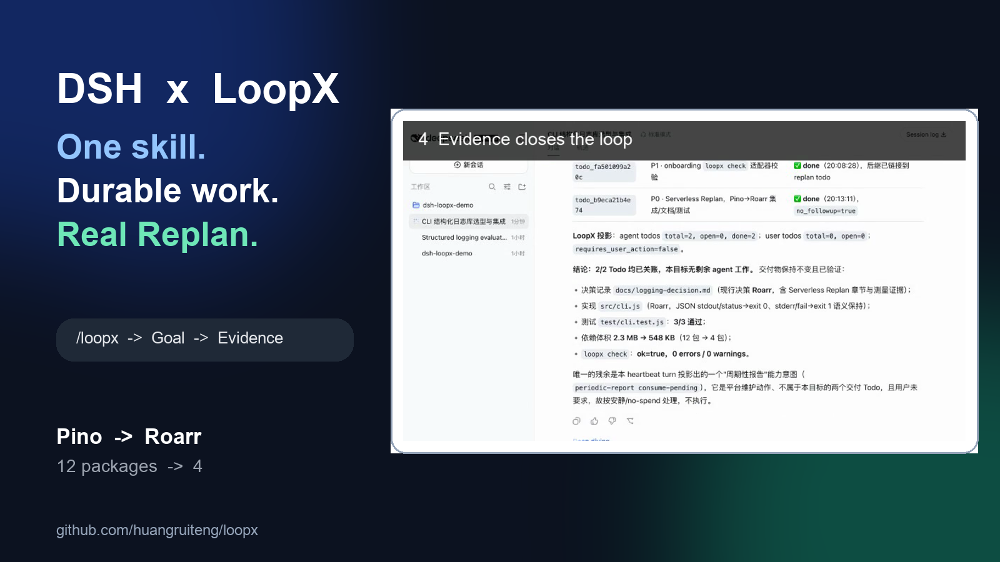

# DSH × LoopX: Replan Without Losing the Decision Trail

**Reproducible demo · real DSH recording · synthetic public-safe workload**

**[Watch the 60-second recording](../../assets/showcases/dsh-loopx/dsh-loopx-quickstart-replan.mp4)** or
[open the runnable fixture](../../../examples/dsh-loopx-demo/README.md).

## The useful loop

A small Node.js CLI needs structured logging. The DSH agent compares Pino,
Consola, and Roarr, records its evidence, and initially selects Pino. The user
then adds a material constraint: the CLI will run in serverless environments,
so cold-start time and dependency footprint now matter more.

Instead of overwriting the first answer, LoopX preserves it as the superseded
decision, records a Replan, creates the successor work, and keeps the same Goal
visible in DSH until implementation and tests settle.

| Evidence | Before the new constraint | After Replan |
| --- | --- | --- |
| Decision | Pino | Roarr |
| Dependency tree | 12 packages | 4 packages |
| Installed footprint in the recorded environment | approximately 2.2 MB | 548 KB |
| CLI behavior | JSON output required | JSON stdout/status and JSON stderr/fail preserved |
| Validation | decision and initial implementation | 3/3 behavior tests, GoalBar 2/2 |

The footprint values are machine-local measurements from this recorded
comparison. The package count and final behavior are reproducible from the
public lockfile and tests; the case does not claim Roarr is always preferable
to Pino.

## Why LoopX matters here

The value is not the logger recommendation by itself. The value is that a
constraint change remains connected to:

- the earlier decision and its evidence;
- the reason that decision became insufficient;
- the successor Todo that implements the revised plan;
- the tests and GoalBar state that prove the revised work settled.

DSH remains the execution host. LoopX supplies the durable Goal, Todo, Replan,
evidence, quota, and continuation control plane above that host.

## Reproduce

Install the published plugin:

    dsh plugin --profile web add \
      "https://github.com/huangruiteng/loopx/releases/download/dsh-loopx-plugin-v0.1.1-beta.4/dsh-loopx-plugin-0.1.1-beta.4.tgz"

Run the deterministic completed fixture:

    cd examples/dsh-loopx-demo
    npm ci --ignore-scripts
    npm test

Or create the baseline and run the full agent path:

    examples/dsh-loopx-demo/reproduce-demo.sh /tmp/dsh-loopx-replan-demo
    cd /tmp/dsh-loopx-replan-demo
    dsh --profile web --port 0

The exact prompts and acceptance boundary are in the
[demo README](../../../examples/dsh-loopx-demo/README.md).

## Evidence boundary

The video is an edited recording of a real DSH session using the published
LoopX plugin. The repository includes only the short product-proof cut, the
synthetic CLI, public package metadata, and deterministic behavior tests. It
excludes credentials, model-provider configuration, raw reasoning, setup
retries, private URLs, local LoopX state, and the unedited recording.

## Share copy

Publication remains an owner decision; these are copy-ready drafts, not a
request to post automatically.

### 中文

把 LoopX 接进 DeepSeek Harness，现在只需要一条很短的路径：

安装 Plugin → 在技能选择器里点 loopx → 直接说任务。

这段 60 秒真实录屏里，Agent 先选择 Pino；收到「serverless 冷启动和体积优先」
的新约束后，LoopX 显式 Replan 到 Roarr：12 个包降到 4 个，行为测试 3/3
通过，GoalBar 最终 2/2。

约束变化，不应该抹掉长程任务的决策与证据链。

https://github.com/huangruiteng/loopx

### English

LoopX now plugs into DeepSeek Harness through a very short path:

install the plugin → pick the loopx skill → describe the task.

In this real 60-second run, the agent first chose Pino. A new serverless
cold-start constraint triggered an explicit Replan to Roarr: 12 packages
became 4, all 3 behavior tests passed, and the GoalBar closed at 2/2.

Changing constraints should not erase the decision and evidence trail of a
long-running task.

https://github.com/huangruiteng/loopx
