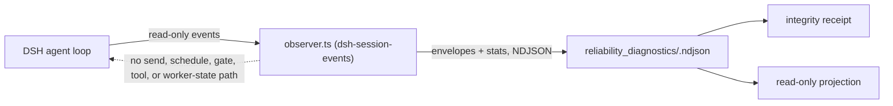

# Reliability Diagnostics

[中文](README.zh-CN.md) | [RFC](../../../docs/architecture/rfcs/long-running-agent-reliability-diagnostics-governed-delivery-v0.md)

Status: experimental, built in, default off, goal scoped. This package ships
the P0 slice of the reliability-diagnostics RFC: the **L1 shadow observer**
contract and its first real event source, DeepSeek Harness (DSH).

An L1 observer sees a long-running agent session and writes an independent
diagnostic record about it. It may **never** influence that session. This
capability makes that promise a machine contract rather than a policy: the
envelope schema cannot express a command, the receipt records the empty set of
outbound endpoints, observer failure is counted and quarantines the evidence,
and the projection carries `mode: read_only` and `authority: none`.



The dashed edge is an asserted absence. Tests reject envelopes carrying
control-shaped fields, the TypeScript module imports nothing from the
continuation driver, and the receipt turns `invalid` if any outbound endpoint
ever appears.

## Placement Rationale

- **Capability id `reliability-diagnostics`** (built in, provider
  `loopx-core`). The caller outcome is "is this run admissible passive
  evidence, and what does it say about stage, stall, repetition, and
  recovery?" No existing capability owns diagnostics without authority.
  Session runtime is a runtime-authority projection, so the diagnostic ledger
  and projection are **siblings** of it, never merged into it. Ids are
  kebab-case like every other catalog id; the package directory is
  `reliability_diagnostics`.
- **Provider id `dsh-session-events`** (origin `extension`). It is delivered by
  the npm package `packages/dsh-loopx-plugin` as `src/observer.ts`, physically
  separate from `driver.ts`. Because an npm plugin has no Python
  `extension.toml` lifecycle, the capability declares the provider on its
  catalog entry and the registry reports it `declared=true`,
  `installed=enabled=ready=false`. The precedent is
  `repository_change_window`, which declares its `git-hook` provider the same
  way.
- **Helpers stay local.** Ledger, receipt, and projection reducers live inside
  this package. The only shared imports are the public-safe value validator
  and the `SOURCE_ID_KEYS` identity tuple; the session-runtime substring
  classifier is deliberately not reused.

## Contract

### Observer envelope (`reliability_observer_envelope_v0`)

| Field | Type | Rule |
| --- | --- | --- |
| `schema_version` | literal | `reliability_observer_envelope_v0` |
| `capability_id` | literal | `reliability-diagnostics` |
| `provider_id` | identity token | e.g. `dsh-session-events` |
| `goal_id`, `session_id` | identity token | `^[A-Za-z0-9][A-Za-z0-9_.:-]{0,120}$` |
| `agent_id` | identity token, optional | |
| `sequence` | integer >= 0 | observer-assigned, monotonic per session; gaps are counted as loss |
| `observed_at` | ISO-8601 with timezone | |
| `clock.source` | enum | `harness_event_time`, `observer_wall_clock`, `fixture` |
| `clock.uncertainty_ms` | integer >= 0 | declared, never inferred |
| `event_kind` | enum | `session_started`, `turn_started`, `turn_ended`, `step_started`, `step_ended`, `user_message`, `tool_called`, `tool_completed`, `agent_status`, `agent_pre_step`, `agent_error`, `session_disposed`, `unsupported` |
| `summary` | object | only `turn`, `step` (integers) and `reason`, `status`, `tool_name`, `error_class`, `source_event_type`, `message_source_kind` (compact tokens) |
| `source_refs` | object | only id keys: `event_id`, `event_seq`, `tool_call_id`, `message_id`, `outcome_id`, `gate_id`, `approval_id`, `artifact_id`, `run_id`, `ref_id` |

Any other field is rejected with a typed reason: `control_field_rejected`
(`command`, `send`, `prompt`, `schedule`, `retry`, `stop`, `resume`, `gate`,
`tool_call`, `worker_state`, ...), `raw_material_field_rejected`
(`transcript`, `messages`, `content`, `text`, `arguments`, `output`,
`stdout`, `stderr`, `log`, `cwd`, `token`, ...), or
`unsupported_field_rejected`. Values also pass the shared public-safe check,
so absolute local paths and credential-like tokens fail closed.

### Observer stats (`reliability_observer_stats_v0`)

Written by every observer implementation next to its envelopes. Fields:
`observer_id`, `emitted_at`, `observed_event_count`, `accepted_event_count`,
`rejected_event_count`, `rejected_by_reason`, `buffer_bound`,
`backpressure_drop_count`, `observer_failure_count`, `outbound_endpoints`
(must be `[]`), `observation_entered_worker_context` (must be `false`),
`clock_source`. Stats are cumulative per observer instance; the receipt keeps
the latest record per `observer_id` and sums across instances.

### Integrity receipt (`reliability_integrity_receipt_v0`)

| Field | Meaning |
| --- | --- |
| `status` | `valid`, `degraded`, `quarantined`, `invalid` (total, ordered) |
| `reason_codes` | typed list; empty only when `valid` |
| `observed_event_count`, `session_count` | accepted envelopes in the ledger |
| `lost_event_count`, `duplicate_sequence_count` | per-session sequence gaps and repeats |
| `ledger_invalid_record_count` | malformed or foreign records found in the ledger |
| `rejected_event_count`, `rejected_by_reason` | refusals reported by observers |
| `buffer_bound`, `backpressure_drop_count`, `observer_failure_count` | bounded-failure evidence |
| `clock.sources`, `clock.max_uncertainty_ms` | declared clocks; > 1000 ms degrades |
| `outbound_endpoints`, `observation_entered_worker_context` | must be `[]` / `false` |
| `event_kinds_consumed`, `summary_fields_consumed` | the exact sources and fields consumed |

Status rules: `invalid` when there are no observations, any outbound endpoint,
or any observation entered worker context; otherwise `quarantined` when the
observer failed, a control-shaped record was seen, or the ledger holds
malformed records; otherwise `degraded` when events were lost, dropped,
duplicated, raw material was rejected, stats are missing, or clock uncertainty
exceeded the threshold; otherwise `valid`.

### Diagnostic projection (`reliability_diagnostic_projection_v0`)

| Field | Meaning |
| --- | --- |
| `mode`, `authority`, `write_scope`, `worker_influence` | `read_only`, `none`, `diagnostic_ledger_only`, `none` |
| `stage` | `unknown`, `idle`, `running`, `tool_running`, `errored`, `disposed` from the last event kind |
| `counts` | turns started/ended, steps, tool calls, errors |
| `stall` | detected only while active and silent for `threshold_ms` (default 300000) relative to `--as-of` |
| `repetition` | longest run of consecutive identical `tool_name` calls; detected at 3 |
| `recovery` | errors followed by a later completed step or non-error turn end count as recovered |
| `signals` | `stall_suspected`, `repetition_suspected`, `unrecovered_error`, `event_loss`, `integrity_not_valid` |
| `integrity` | the receipt status and reason codes |

## Use It

```bash
# Enable the DSH provider for exactly one goal, then start DSH as usual.
export LOOPX_DSH_SHADOW_OBSERVER_GOAL_ID=<goal-id>
# Optional: LOOPX_DSH_SHADOW_OBSERVER_LEDGER_DIR, LOOPX_DSH_SHADOW_OBSERVER_BUFFER_BOUND

loopx reliability-diagnostics receipt --goal-id <goal-id> --format json
loopx reliability-diagnostics status  --goal-id <goal-id> --format json
loopx reliability-diagnostics ingest  --goal-id <goal-id> --input observer.ndjson --format json
```

The ledger lives at `<runtime-root>/reliability_diagnostics/<goal-id>.ndjson`;
the default runtime root is the same one the rest of LoopX uses and the CLI
prints only the relative `ledger_ref`. `ingest` re-validates every line; a
clean ingest is a transparent copy, and the ingest gate records a stats record
of its own only when it refused, dropped, or failed something.

With the environment variable unset the observer registers no hooks and
writes no files (feature-off parity). When set, `observer.ts` observes
`agent/session-start`, `agent/status`, `agent/error`, `agent/pre-step`
(pass-through), `session/event`, and `session/disposed`; token-level
`assistant/chunk` events are not consumed, which the receipt shows through
`event_kinds_consumed`.

## Validation

```bash
python3 examples/reliability_diagnostics/dsh-shadow-observer-fixture-smoke.py
python3 -m pytest tests/capabilities/test_reliability_diagnostics.py tests/capabilities/test_reliability_diagnostics_dsh_provider.py -q
cd packages/dsh-loopx-plugin && pnpm typecheck && pnpm test -- observer
```

The fixture is a fixed DSH-shaped stream with one missing sequence, one event
stamped with 1500 ms clock uncertainty, one raw-material-bearing record, and a
burst that overflows a 20-record buffer. Its receipt is `degraded` with exactly
`sequence_gap`, `backpressure_drop`, `raw_material_rejected`, and
`clock_uncertainty_exceeded`; the projection reports repetition on `read`, one
recovered error, and no stall.

## Non-Goals In This Slice

No dashboard surface, no L2 recommendations, no automatic recovery, no
writeback into goals, todos, gates, or session runtime, and no change to the
`loopx status` first screen. The observer attributes every session in the DSH
process to the single declared goal; per-session binding discovery is a
follow-up that must not reuse the driver's LoopX CLI path.
