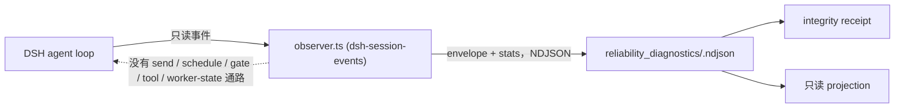

# Reliability Diagnostics 能力介绍

[English](README.md) | [RFC](../../../docs/architecture/rfcs/long-running-agent-reliability-diagnostics-governed-delivery-v0.md)

状态：实验能力、内置、默认关闭、goal-scoped。本包交付 reliability-diagnostics RFC
的 P0 切片：**L1 shadow observer** 合约，以及第一个真实事件源 DeepSeek Harness（DSH）。

L1 observer 观察一个长时运行的 Agent 会话，并写下独立的诊断记录；它**永远不能**
影响该会话。本能力把这条承诺做成机器合约而不是口头规范：envelope schema 无法表达
命令，receipt 记录 outbound endpoint 为空集，observer 故障被计数并让证据进入
quarantined，projection 携带 `mode: read_only` 与 `authority: none`。



虚线边表示一条被断言不存在的路径：测试拒绝带控制字段的 envelope，TypeScript 模块
不从 continuation driver 导入任何东西，一旦出现 outbound endpoint，receipt 即为 `invalid`。

## 放置理由

- **能力 id `reliability-diagnostics`**（内置，provider `loopx-core`）。调用方结果是
  "这次运行是否可作为被动证据，它对 stage / stall / repetition / recovery 说了什么"。
  没有现有能力拥有"无权威的诊断"这一结果。session runtime 是运行时权威投影，因此诊断
  ledger 与 projection 是它的**同级**，绝不合并进去。id 与其它 catalog 条目一样使用
  kebab-case；包目录为 `reliability_diagnostics`。
- **Provider id `dsh-session-events`**（origin `extension`）。由 npm 包
  `packages/dsh-loopx-plugin` 的 `src/observer.ts` 交付，与 `driver.ts` 物理分离。
  npm 插件没有 Python `extension.toml` 生命周期，因此由能力在 catalog entry 上声明该
  provider，registry 报告 `declared=true`、`installed=enabled=ready=false`。先例是
  `repository_change_window` 声明其 `git-hook` provider 的方式。
- **辅助逻辑留在本包内。** ledger、receipt、projection reducer 都在本包。仅共享
  public-safe 值校验器与 `SOURCE_ID_KEYS` 身份键；刻意不复用 session-runtime 的子串分类器。

## 合约

### Observer envelope（`reliability_observer_envelope_v0`）

| 字段 | 类型 | 规则 |
| --- | --- | --- |
| `schema_version` | 字面量 | `reliability_observer_envelope_v0` |
| `capability_id` | 字面量 | `reliability-diagnostics` |
| `provider_id` | identity token | 例如 `dsh-session-events` |
| `goal_id`、`session_id` | identity token | `^[A-Za-z0-9][A-Za-z0-9_.:-]{0,120}$` |
| `agent_id` | identity token，可选 | |
| `sequence` | 整数 >= 0 | observer 分配、每会话单调；缺口计为丢失 |
| `observed_at` | 带时区的 ISO-8601 | |
| `clock.source` | 枚举 | `harness_event_time`、`observer_wall_clock`、`fixture` |
| `clock.uncertainty_ms` | 整数 >= 0 | 显式声明，绝不推断 |
| `event_kind` | 枚举 | `session_started`、`turn_started`、`turn_ended`、`step_started`、`step_ended`、`user_message`、`tool_called`、`tool_completed`、`agent_status`、`agent_pre_step`、`agent_error`、`session_disposed`、`unsupported` |
| `summary` | 对象 | 仅允许 `turn`、`step`（整数）与 `reason`、`status`、`tool_name`、`error_class`、`source_event_type`、`message_source_kind`（紧凑 token） |
| `source_refs` | 对象 | 仅允许 id 键：`event_id`、`event_seq`、`tool_call_id`、`message_id`、`outcome_id`、`gate_id`、`approval_id`、`artifact_id`、`run_id`、`ref_id` |

其它任何字段都会被拒绝并带上类型化原因：`control_field_rejected`（`command`、`send`、
`prompt`、`schedule`、`retry`、`stop`、`resume`、`gate`、`tool_call`、`worker_state` 等）、
`raw_material_field_rejected`（`transcript`、`messages`、`content`、`text`、`arguments`、
`output`、`stdout`、`stderr`、`log`、`cwd`、`token` 等）或 `unsupported_field_rejected`。
值还要通过共享的 public-safe 检查，绝对本地路径与凭据样式 token 会 fail closed。

### Observer stats（`reliability_observer_stats_v0`）

每个 observer 实现都会把它写在 envelope 旁边。字段：`observer_id`、`emitted_at`、
`observed_event_count`、`accepted_event_count`、`rejected_event_count`、
`rejected_by_reason`、`buffer_bound`、`backpressure_drop_count`、`observer_failure_count`、
`outbound_endpoints`（必须为 `[]`）、`observation_entered_worker_context`（必须为 `false`）、
`clock_source`。stats 按 observer 实例累计；receipt 取每个 `observer_id` 的最新记录并跨实例求和。

### Integrity receipt（`reliability_integrity_receipt_v0`）

| 字段 | 含义 |
| --- | --- |
| `status` | `valid`、`degraded`、`quarantined`、`invalid`（全覆盖、有序） |
| `reason_codes` | 类型化列表；仅 `valid` 时为空 |
| `observed_event_count`、`session_count` | ledger 中被接受的 envelope |
| `lost_event_count`、`duplicate_sequence_count` | 每会话 sequence 缺口与重复 |
| `ledger_invalid_record_count` | ledger 中损坏或异类记录 |
| `rejected_event_count`、`rejected_by_reason` | observer 报告的拒绝 |
| `buffer_bound`、`backpressure_drop_count`、`observer_failure_count` | 有界失败证据 |
| `clock.sources`、`clock.max_uncertainty_ms` | 声明的时钟；> 1000 ms 时降级 |
| `outbound_endpoints`、`observation_entered_worker_context` | 必须为 `[]` / `false` |
| `event_kinds_consumed`、`summary_fields_consumed` | 实际消费的事件源与字段 |

状态规则：无观测、任一 outbound endpoint、或观测进入 worker context 时为 `invalid`；
否则 observer 故障、出现控制字段记录、或 ledger 含损坏记录时为 `quarantined`；否则
事件丢失、被丢弃、重复、拒绝了原始材料、缺少 stats、或时钟不确定度超阈值时为
`degraded`；否则为 `valid`。

### Diagnostic projection（`reliability_diagnostic_projection_v0`）

| 字段 | 含义 |
| --- | --- |
| `mode`、`authority`、`write_scope`、`worker_influence` | `read_only`、`none`、`diagnostic_ledger_only`、`none` |
| `stage` | 由最后一个事件种类得出：`unknown`、`idle`、`running`、`tool_running`、`errored`、`disposed` |
| `counts` | turn 开始/结束、step、tool 调用、错误 |
| `stall` | 仅在活跃且相对 `--as-of` 静默达 `threshold_ms`（默认 300000）时判定 |
| `repetition` | 连续相同 `tool_name` 的最长 run；达 3 判定 |
| `recovery` | 错误之后出现完成的 step 或非错误的 turn end 计为已恢复 |
| `signals` | `stall_suspected`、`repetition_suspected`、`unrecovered_error`、`event_loss`、`integrity_not_valid` |
| `integrity` | receipt 的 status 与 reason codes |

## 使用方式

```bash
# 只为一个 goal 启用 DSH provider，然后照常启动 DSH。
export LOOPX_DSH_SHADOW_OBSERVER_GOAL_ID=<goal-id>
# 可选：LOOPX_DSH_SHADOW_OBSERVER_LEDGER_DIR、LOOPX_DSH_SHADOW_OBSERVER_BUFFER_BOUND

loopx reliability-diagnostics receipt --goal-id <goal-id> --format json
loopx reliability-diagnostics status  --goal-id <goal-id> --format json
loopx reliability-diagnostics ingest  --goal-id <goal-id> --input observer.ndjson --format json
```

ledger 位于 `<runtime-root>/reliability_diagnostics/<goal-id>.ndjson`；默认 runtime root
与 LoopX 其它部分一致，CLI 只打印相对的 `ledger_ref`。`ingest` 会重新校验每一行；干净的
ingest 是透明拷贝，只有当 ingest 门拒绝、丢弃或失败了某些记录时才会写入自己的 stats 记录。

未设置环境变量时，observer 不注册任何 hook、不写任何文件（feature-off parity）。
设置后，`observer.ts` 观察 `agent/session-start`、`agent/status`、`agent/error`、
`agent/pre-step`（透传）、`session/event`、`session/disposed`；token 级的
`assistant/chunk` 不被消费，receipt 通过 `event_kinds_consumed` 让这一点可见。

## 验证

```bash
python3 examples/reliability_diagnostics/dsh-shadow-observer-fixture-smoke.py
python3 -m pytest tests/capabilities/test_reliability_diagnostics.py tests/capabilities/test_reliability_diagnostics_dsh_provider.py -q
cd packages/dsh-loopx-plugin && pnpm typecheck && pnpm test -- observer
```

fixture 是一条固定的 DSH 形态事件流：缺一个 sequence、一个事件带 1500 ms 时钟不确定度、
一条带原始材料的记录、以及一段撑爆 20 条缓冲的突发。其 receipt 为 `degraded`，原因恰为
`sequence_gap`、`backpressure_drop`、`raw_material_rejected`、`clock_uncertainty_exceeded`；
projection 报告 `read` 上的重复、一次已恢复的错误、无 stall。

## 本切片的非目标

不做 dashboard、不做 L2 建议、不做自动恢复、不回写 goal / todo / gate / session runtime、
不改 `loopx status` 首屏。observer 把 DSH 进程内所有会话归属到唯一声明的 goal；按会话的
绑定发现是后续工作，且不得复用 driver 的 LoopX CLI 通路。
